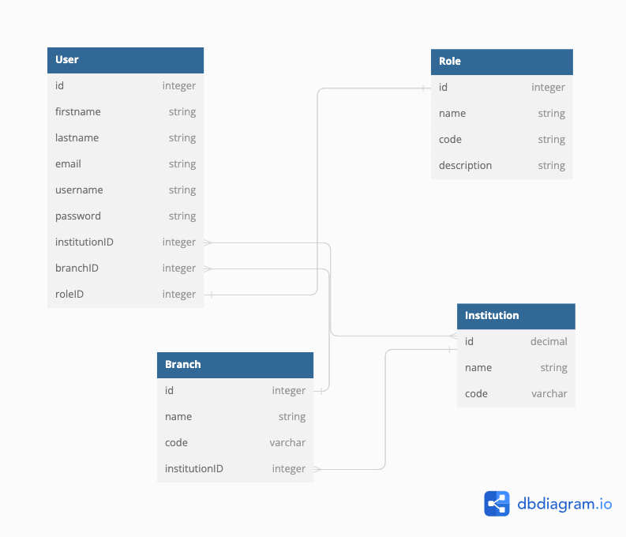

# Bank-Customer-Account-Management-System

Banking Customer Management System is a system through bank customers,employee and other corporate users can all interface together at the same point while segregating role and permissions. The system will manage different types of users, such as bank customers (Type A Users) who own the accounts and manages transactions, bank employees (Type B Users) who help in other management duties, and corporate clients (Type C Users) who in this case can be like Federal Bank or any other higher authority who may wants to see users statistics. All the system users have different roles with role specific code the can be assigned to them which help to segregate different roles. The system will allow users to access various banking services and functionalities based on their roles and institutions.

## MySQL database entity design and relationships

# How to setup the system

Via GitHub Repo: 
1. Clone or Download this Repo
2. setup you MySQL server and create a database called BACMSDB
3. Using intelij or your prefered IDE build and run the application.
4. Booom you in. Follow the Api Documentation for guidance URL: https://documenter.getpostman.com/view/21029286/2s9XxwwuF5
